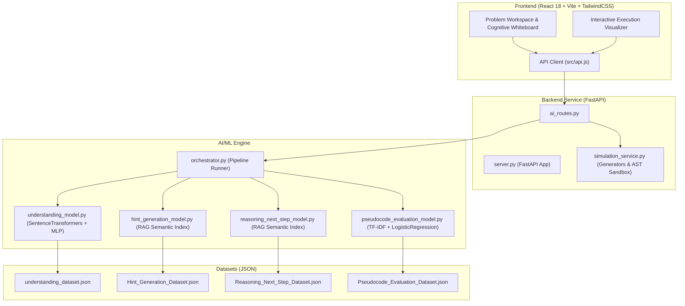

# 🧠 AlgoMentor — AI-Assisted DSA Learning Environment

**AlgoMentor** is an intelligent, interactive educational platform designed to help students learn Data Structures & Algorithms (DSA) through cognitive reasoning feedback, progressive AI hint generation, pseudocode evaluation, and step-by-step execution simulation.

---

## 📌 Problem Statement

Learning Data Structures & Algorithms often presents a high barrier to entry for computer science students:
- Traditional platforms only evaluate final code outputs (pass/fail test cases) without analyzing the student's **cognitive thought process** or intermediate reasoning.
- Generic AI assistants often reveal complete code solutions immediately, hindering deep conceptual learning.
- Static visualizers lack integration with student reasoning, making dry-runs feel disconnected from problem-solving.

---

## 🎯 Motivation

AlgoMentor bridges the gap between passive algorithm visualization and active problem-solving by providing:
1. **Thinking State Classification**: Identifying whether a student is stuck, reasoning deeply, off-track, or on a surface level.
2. **Pedagogical AI Hints**: Delivering progressive, non-revealing hints tailored to the student's current cognitive state.
3. **Reasoning Next-Step Guidance**: Suggesting logical next steps without revealing full code.
4. **Step-by-Step Execution Simulation**: Visualizing array pointer operations (`i`, `j`), comparisons, swaps, and graph traversals (`BFS`/`DFS`) live as the algorithm runs.

---

## ✨ Features

- **Cognitive Whiteboard**: Interactive workspace for writing pseudocode, flowcharts, or conceptual breakdowns.
- **AI Understanding Classifier**: Evaluates student thoughts and classifies thinking states (`surface_thinking`, `deep_reasoning`, `stuck`, `off_track`, `optimal_thinking`).
- **Contextual RAG Hint Engine**: Uses dense semantic embeddings (`all-MiniLM-L6-v2`) to retrieve context-aware hints boosted by problem ID and cognitive state.
- **Progressive Next-Step Predictor**: Recommends 3 distinct logical next steps with diversity prefix re-ranking.
- **Pseudocode Evaluator**: Classifies approach quality (`brute_force`, `better`, `optimal`, `incorrect`).
- **Interactive Dry-Run Simulator**:
  - Live array pointer visualization (`i`, `j`, `i=j`) with state highlights.
  - Graph traversal visualization (`BFS`/`DFS`) with frontier queue/stack and visited sets.
  - Safe Python Execution Sandbox with AST security checks and 500-step execution caps.
  - Optimal solution comparison side-by-side.

---

## 🏗️ System Architecture



---

## 🛠️ Technology Stack

| Layer | Technologies Used |
| :--- | :--- |
| **Frontend** | React 18, Vite, Tailwind CSS, Lucide React, Framer Motion, Canvas Confetti |
| **Backend** | Python 3.13, FastAPI, Uvicorn, Pydantic, Starlette TestClient |
| **AI / ML** | PyTorch, SentenceTransformers (`all-MiniLM-L6-v2`), Scikit-Learn, Joblib, NumPy |
| **Testing** | Pytest, HTTPX |

---

## 📊 Datasets & ML Model Methodology

### 1. Understanding Model
- **Input**: `problem_description`, `user_thought`, `problem_id`
- **Architecture**: Multi-input feature concatenation combining dual 384-dimensional sentence embeddings (`all-MiniLM-L6-v2`) and One-Hot encoded problem IDs fed into an MLP Classifier (512 → 256 → 128) with early stopping.
- **Evaluated Performance**: 100% Accuracy / F1-score on stratified validation split.

### 2. Hint Generation Model (RAG)
- **Architecture**: Dense semantic index using `all-MiniLM-L6-v2`. Cosine similarity retrieval with contextual score boosts (+0.15 for matching `problem_id`, +0.20 for matching `thinking_state`).
- **Evaluated Performance**: 100% Hit@3 Retrieval Accuracy.

### 3. Reasoning Next-Step Model (RAG)
- **Architecture**: Dense semantic retrieval over problem-state pairs with prefix-based diversity re-ranking to ensure 3 unique next steps.
- **Evaluated Performance**: 1.0000 MRR@3 (Mean Reciprocal Rank).

### 4. Pseudocode Evaluation Model
- **Architecture**: TF-IDF Vectorizer (ngram range 1-2, 3000 max features) + Logistic Regression classifier.

---

## 🛡️ Security & Code Sandboxing

Custom Python code tracing (`problem_id == "custom"`) employs multi-layered execution safety:
1. **AST Safety Checker**: Inspects code abstract syntax tree prior to compilation. Strictly blocks imports (`import`, `from ... import`) and sensitive calls (`open`, `eval`, `exec`, `__import__`, `globals`, `locals`, `getattr`, `os`, `sys`, `subprocess`, `socket`).
2. **Step Limit Cap**: Enforces a maximum limit of **500 execution steps** via `sys.settrace` to prevent infinite loops.

---

## 🚀 Installation & Setup

### Prerequisites
- Python 3.10+
- Node.js 18+ and npm

### 1. Clone & Set Up Virtual Environment

```bash
git clone https://github.com/SAKSHI-BHATI/algomentor.git
cd My_AlgoMentor

# Create and activate virtual environment
python3 -m venv venv
source venv/bin/activate  # On Windows: venv\Scripts\activate

# Install backend & ML dependencies
pip install --upgrade pip
pip install fastapi uvicorn pydantic scikit-learn sentence-transformers joblib numpy pytest httpx
```

### 2. Install Frontend Dependencies

```bash
cd app/frontend/Algomentor
npm install
cd ../../..
```

---

## 🏃 Running the Application

### 1. Train AI Models

```bash
PYTHONPATH=. ./venv/bin/python AI_engine/retrain.py
```

### 2. Start Backend Server

```bash
PYTHONPATH=. ./venv/bin/uvicorn Backend.server:app --reload --port 8000
```
Backend interactive API docs will be available at [http://127.0.0.1:8000/docs](http://127.0.0.1:8000/docs).

### 3. Start Frontend Development Server

```bash
cd app/frontend/Algomentor
npm run dev
```
Open [http://localhost:5173](http://localhost:5173) in your browser.

---

## 🧪 Running Automated Tests

Run the full unit and integration test suite:

```bash
PYTHONPATH=. ./venv/bin/pytest tests/ -v
```

Expected output:
```text
tests/test_ai_engine.py::test_understanding_model PASSED
tests/test_ai_engine.py::test_hint_model PASSED
tests/test_ai_engine.py::test_next_step_model PASSED
tests/test_ai_engine.py::test_pseudocode_evaluation_model PASSED
tests/test_ai_engine.py::test_orchestrator_full_stage PASSED
tests/test_backend_api.py::test_home_endpoint PASSED
tests/test_backend_api.py::test_understanding_api PASSED
tests/test_backend_api.py::test_hint_api PASSED
tests/test_backend_api.py::test_next_step_api PASSED
tests/test_backend_api.py::test_evaluate_api PASSED
tests/test_backend_api.py::test_simulate_api PASSED
tests/test_simulation.py::test_bubble_sort_visualizer PASSED
tests/test_simulation.py::test_binary_search_visualizer PASSED
tests/test_simulation.py::test_two_sum_simulation PASSED
tests/test_simulation.py::test_bfs_simulation PASSED
tests/test_simulation.py::test_ast_security_blocks_import PASSED
tests/test_simulation.py::test_ast_security_blocks_open PASSED
tests/test_simulation.py::test_custom_code_execution_safe PASSED
======================== 18 passed in 14.86s ========================
```

---

## 📄 License

This project is open-source and available under the [MIT License](LICENSE).
